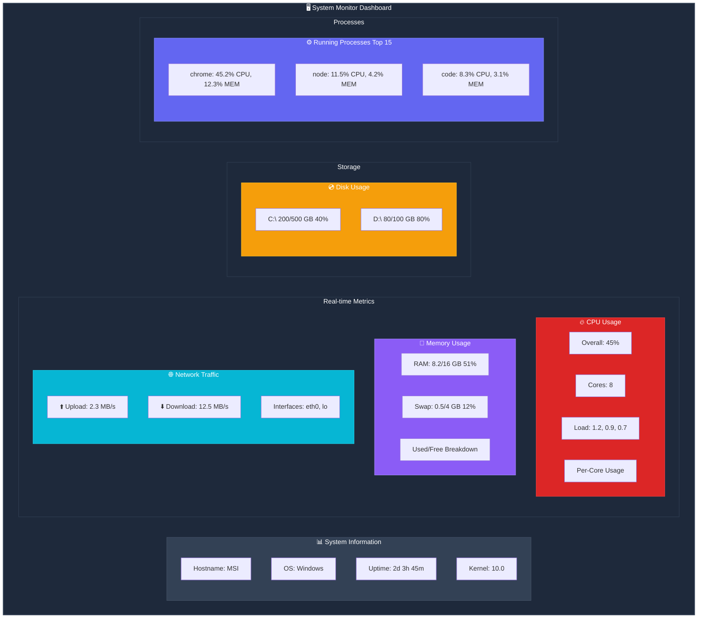

# System Monitor

```
   _____ __  __ _____ _______ ______ __  __   __  __  ____  _   _ _____ _______ ____  _____  
  / ____|\ \/ // ____|__   __|  ____|  \/  | |  \/  |/ __ \| \ | |_   _|__   __/ __ \|  __ \ 
 | (___  \  /| (___    | |  | |__  | \  / | | \  / | |  | |  \| | | |     | | | |  | | |__) |
  \___ \  \/  \___ \   | |  |  __| | |\/| | | |\/| | |  | | . ` | | |     | | | |  | |  _  / 
  ____) |     ____) |  | |  | |____| |  | | | |  | | |__| | |\  |_| |_    | | | |__| | | \ \ 
 |_____/     |_____/   |_|  |______|_|  |_| |_|  |_|\____/|_| \_|_____|   |_|  \____/|_|  \_\
```

**Real-Time Server Resource Monitor** built with **Elixir & Phoenix LiveView**

---

## 🎯 Features

- 📊 **CPU Monitoring** - Overall + per-core usage, load averages
- 💾 **Memory Tracking** - RAM + Swap usage with percentages
- 💿 **Disk Usage** - All partitions with color-coded warnings
- 🌐 **Network Traffic** - Upload/download speeds in real-time
- ⚙️  **Process Management** - Top 15 processes by CPU usage
- 🖥️  **System Info** - Hostname, OS, uptime, kernel version
- 🔄 **Auto-Updates** - Real-time updates every 1 second via WebSocket
- 🎨 **Beautiful UI** - Dark theme with TailwindCSS

---

## ⚡ Quick Start

### Automated Setup (Recommended)

**Windows Batch:**
```batch
start.bat
```

**PowerShell:**
```powershell
.\start.ps1
```

Just double-click `start.bat` or run the PowerShell script. It will:
- ✅ Check Elixir installation
- ✅ Install dependencies
- ✅ Setup Tailwind & ESBuild
- ✅ Build assets
- ✅ Start server
- ✅ Open browser automatically at http://localhost:4000

### Manual Setup

```bash
# Install dependencies
mix deps.get

# Build assets
cd assets
..\\_build\tailwind-x64\tailwind.exe -i css\app.css -o ..\priv\static\assets\app.css -c tailwind.config.js
cd ..
_build\esbuild-windows-x64-0.17.11\esbuild.exe assets\js\app.js --bundle --target=es2017 --outdir=priv\static\assets --external:phoenix --external:phoenix_html --external:phoenix_live_view --external:topbar

# Start server
mix phx.server
```

Then open: **http://localhost:4000**

---

## 📦 Tech Stack

**Backend:**
- Elixir 1.14+
- Phoenix Framework 1.7
- Phoenix LiveView 0.20
- Erlang `:os_mon` (`:cpu_sup`, `:memsup`, `:disksup`)
- Phoenix PubSub

**Frontend:**
- Phoenix LiveView Components
- TailwindCSS 3.3
- ESBuild
- JavaScript (Phoenix Hooks)

---

## 🏗️ Architecture

```
Browser (LiveView)
     ↑        ↓  (WebSocket)
Phoenix LiveView Process
     ↓
SystemMonitor GenServer
     ↓
Metrics Collectors (CPU, Memory, Disk, Network, Processes, System)
     ↓
Native System Commands / Erlang Built-ins
     ↓
System Resources
```

---

## 📁 Project Structure

```
monitor/
├── lib/
│   ├── monitor/
│   │   ├── application.ex          # Supervision tree
│   │   ├── system_monitor.ex       # GenServer (metrics collector)
│   │   └── metrics/                # Individual metric modules
│   │       ├── cpu.ex
│   │       ├── memory.ex
│   │       ├── disk.ex
│   │       ├── network.ex
│   │       ├── processes.ex
│   │       └── system.ex
│   └── monitor_web/
│       ├── live/
│       │   └── dashboard_live.ex   # Main dashboard LiveView
│       └── components/
│           └── core_components.ex  # Reusable components
├── assets/                         # CSS, JS, Tailwind config
├── config/                         # Configuration files
├── start.bat                       # Automated startup (Batch)
├── start.ps1                       # Automated startup (PowerShell)
└── test/                           # Test files
```

---

## 🎨 Dashboard Overview



**Live Features:**
- 🔄 **Auto-refresh every 1 second** via WebSocket
- 📈 **Color-coded progress bars** (Green < 60%, Yellow 60-80%, Red > 80%)
- 🎨 **Dark theme** with smooth animations
- 📱 **Responsive layout** adapts to screen size

---

## ✨ Key Features

### CPU Monitoring
- Overall CPU usage percentage
- Per-core usage visualization
- Load averages (1m, 5m, 15m)
- Core count detection
- Color-coded progress bars

### Memory Monitoring
- Total RAM (MB/GB)
- Used/Free RAM
- Swap usage tracking
- Usage percentage
- Visual progress indicators

### Disk Usage
- All mounted partitions
- Total/Used/Free space (GB)
- Usage percentage
- Color warnings (>80% = yellow, >90% = red)
- Mount point information

### Network Traffic
- Upload speed (MB/s)
- Download speed (MB/s)
- Total bytes transferred
- Active network interfaces
- Per-interface statistics

### Process Management
- Top 15 processes by CPU
- PID, Name, Status
- CPU % (color-coded)
- Memory usage %
- Command line details

### System Information
- Hostname
- Operating system type
- System uptime
- Kernel version
- Architecture (32/64-bit)

---

## 🚀 Requirements

- **Elixir** 1.14 or higher
- **Erlang/OTP** 24 or higher
- **Windows** (or Linux/macOS with minor adjustments)

### First-Time Installation

If Elixir is not installed:

```powershell
# Install Chocolatey (if not installed)
Set-ExecutionPolicy Bypass -Scope Process -Force
[System.Net.ServicePointManager]::SecurityProtocol = [System.Net.ServicePointManager]::SecurityProtocol -bor 3072
iex ((New-Object System.Net.WebClient).DownloadString('https://community.chocolatey.org/install.ps1'))

# Install Elixir
choco install elixir -y
```

---

## 🛠️ Development

### Configuration

Update settings in `config/dev.exs`:

```elixir
config :monitor, MonitorWeb.Endpoint,
  http: [port: 4000],  # Change port here
  debug_errors: true,
  code_reloader: true
```

### Metrics Update Interval

Modify in `lib/monitor/system_monitor.ex`:

```elixir
@update_interval 1000  # Change to 500 for 0.5s, 2000 for 2s, etc.
```

### Running Tests

```bash
mix test
```

---

## 📚 Learn More

- **Phoenix LiveView**: https://hexdocs.pm/phoenix_live_view
- **Erlang :os_mon**: https://www.erlang.org/doc/man/os_mon_app.html
- **GenServer**: https://hexdocs.pm/elixir/GenServer.html
- **Phoenix PubSub**: https://hexdocs.pm/phoenix_pubsub

---

## 🎓 How It Works

1. **SystemMonitor GenServer** collects metrics every 1 second
2. **Six metric collectors** (CPU, Memory, Disk, Network, Processes, System) gather data
3. **Phoenix PubSub** broadcasts updates to all connected clients
4. **LiveView** receives updates via WebSocket and re-renders automatically
5. **TailwindCSS** provides responsive, beautiful styling

---

## 🐛 Troubleshooting

### Port 4000 already in use
```bash
# Kill process on port 4000
netstat -ano | findstr :4000
taskkill /PID <PID_NUMBER> /F
```

### Assets not loading
```bash
# Rebuild assets
start.bat
# or
.\start.ps1
```

### Elixir not found after installation
- Restart PowerShell/CMD
- Check: `elixir --version`
- Ensure PATH includes Elixir installation

---

## 🌟 Why This Project?

- ✅ **Production-Ready** - Proper supervision, error handling, config
- ✅ **Real-Time** - 1-second refresh via WebSocket
- ✅ **Efficient** - Single GenServer, optimized collection
- ✅ **Scalable** - PubSub allows unlimited viewers
- ✅ **Beautiful** - Modern dark theme with TailwindCSS
- ✅ **Well-Documented** - Comprehensive guides and comments
- ✅ **Extensible** - Clean architecture, easy to enhance
- ✅ **Cross-Platform** - Works on Windows, Linux, macOS

---

## 📝 License

MIT License - Feel free to use and modify!

---

## 🎉 Happy Monitoring!

Built with ❤️ using Elixir and Phoenix LiveView
